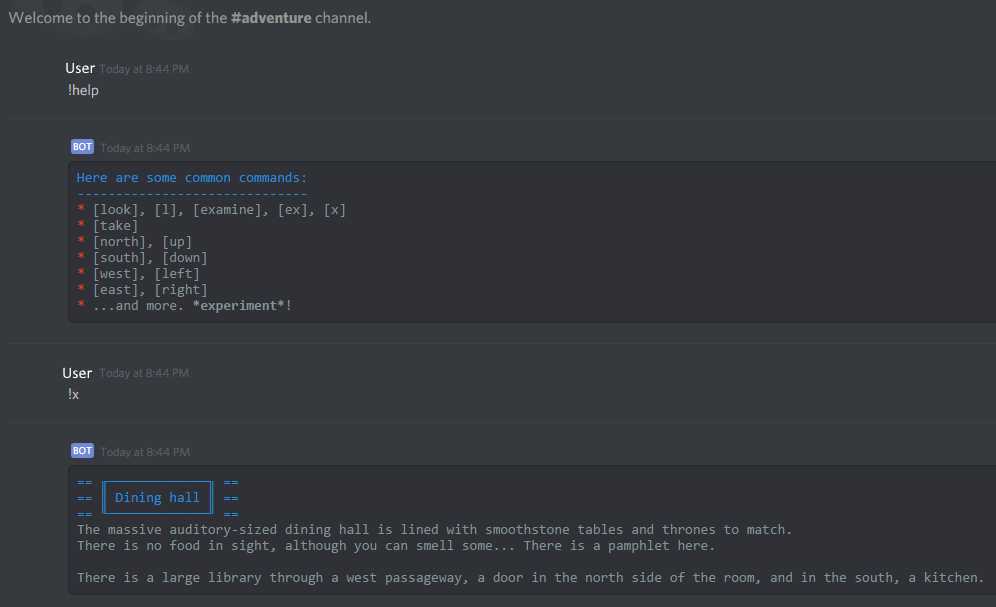

# Daedalus

Daedalus is a mockup.

It's an experiment in creating a text adventure game system, that interfaces with discord.

It makes use of [discordrb](https://github.com/meew0/discordrb), but does not use its voice functionality, and thus does not use libsodium.



## How it works

```ruby
SEED_FILE =     'seed.yaml'
CONFIG_FILE =   'discord_config.yaml'
USERDATA_FILE = 'userdata.yaml'
  (...)
$system = Daedalus.new SEED_FILE, USERDATA_FILE, CONFIG_FILE
```

* `SEED_FILE`: Must exist, is where the basic data structure of the userdata file is defined, and is where the world file is set
* `CONFIG_FILE`: Must also exist, simple yaml file with the discord bot's token, client id, what prefix commands will use, and an optional but recommended admin user id.
* `USERDATA_FILE`: This file is generated at startup using the seed file, and by extension the world file. It's where the adventure is "saved". All actions that impact the world are set to save to userdata.
* World file, `world.yaml`: This is where the text adventure proper is defined. Rooms and items are defined here, so that you can (l)ook at a feature of a room.

```ruby
$system.load_world
$system.connect
$system.init
```

With the first line, the world file is properly loaded. It has to be loaded only after instanciating `$system`. Note that the world file's path is specified in the seed file, with `world_file`.

The second line connects the bot to discord.

The third line starts the bot proper, so it may receive commands.

The discord config file follows this structure:

```yaml
---
token: # your bot token goes here
client_id: 222222222222222222 # this is your bot's client id
prefix: 'å' # command prefix
admin: 00000000000000000 # this is the bot admins user id
```

## Example of play

Proper play is structured around rooms with at most 4 connections in the corresponding cardinal directions, and lists of "items" that can be both items in the traditional sense as well as simply features of the "room", such as a window.

The following is the structure of a room, as defined in the world file.

```yaml
rooms:
  99:
    name: Bedroom
    description: |-
      This is where you go to rest when you're tired. A little window sits at the eastern wall, peeking at the outside world.
      There are toys strewn about the room, and a closed suitcase at the foot of your bed.

      You can leave the room through the door to the west.
    fardescription: This door leads to your room.
    items:
      - window
      - toys
      - suitcase
      - bed
    connections:
      north: ~
      south: ~
      west: 98
      east: ~
```

As you can see there is a name for the room, a proper description, a shorter description for when you are (l)ooking at it from a different room, and then a list of item names and a list of connections. Going west in this room would land you in room 98, whatever that might be, however the remaining three directions don't go anywhere.

The item list above is *just* a list, a way for Daedalus to refer to the actual item registry (still in the world file):

```yaml
items:
  toys:
    name: toys
    symbol: 🐩
    synonyms:
      - toys
      - toy
    description: A bunch of toys are on the ground...
    reaction:
      - take
      - get
```

If you (l)ook at a feature of a room, Daedalus will spit out its description: `A bunch of toys are on the ground...`

Additionally, you may set synonyms for features. Be careful not to set conflicting synonyms or names.

Items get a little symbol that goes next to their names when you (l)ook at them, which is defined here, also.

Most importantly, two reactions are defined here: "take" and "play". These reactions mean that if you invoke those commands followed by "toy" or "toys", something appropriate will happen.

Below is what `commands.rb` would define for the "take" command:

```ruby
$system.bot.command(:take) do |e, *target|
  target = [] if target.nil?
  if target.length == 0
    # command invoked by itself
    e.respond "What are you trying to take?"
  elsif target.length == 1
    target = target[0].downcase
    # command invoked with 1-word argument
    if $system.world.rooms[$system.world.locate e.user.id]["items"].include?("toys") && $system.world.items["toys"]["synonyms"].include?(target)
      # there are toys where you are, and you asked for a synonym of the toys item.
      $system.react :type => "take", :user => e.user.id, :item => "toys", :room => ($system.world.locate e.user.id)
      e.respond $system.utils.get_message
    else
      # default to this.
      e.respond 'There is no such thing here.'
    end
  end
end
```

The most important line here, that comes after checking if you are in fact trying to take the toys, and that you are capable of doing so, is this:

```ruby
$system.react :type => "take", :user => e.user.id, :item => "toys", :room => ($system.world.locate e.user.id)
```

This line invokes a reaction from `reactions.rb`:

```ruby
class Daedalus
  def react o = {}
    if !o[:user].nil?
      if o[:type] == "take"
        if o[:item] == "toys"
          if o[:room] == 99
            $system.userdata["users"][o[:user]]["inventory"] << "toy soldier"
            $system.utils.store_message "You take one of the toys."
          end
        end

    (...)
```

Upon invoking this reaction, "take", in the room 99, on the "toys", we add an item named "toy soldier" to the user's inventory,
and call `Daedalus::Utils#store_message`.

Going back to the previous code block, right after we invoked this reaction, we have this line:

```ruby
e.respond $system.utils.get_message
```

...which has the bot respond in chat with "You take one of the toys", a string set in `reactions.rb`.

## License

This project is available as open source under the terms of the [MIT License](http://opensource.org/licenses/MIT).
